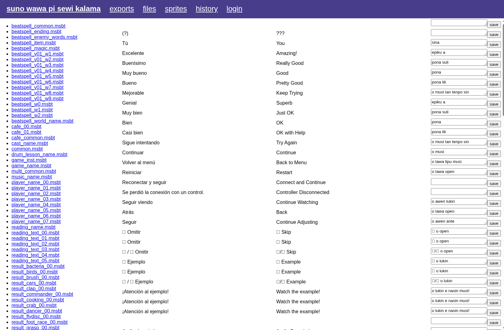

# suno-wawa-pi-sewi-kalama
Rhythm Heaven Groove (Miracle stars) toki pona translation tool

## Features
- Authentication
- Translating text to toki pona using [MSBTConverter](https://github.com/KillzXGaming/MSBTConverter)
- Encoding the translations as [UCSUR sitelen pona](https://sona.pona.la/wiki/Under-ConScript_Unicode_Registry)
- Replacing in-game text fonts to display sitelen pona correctly
- Translating sprites to toki pona using [textool](https://github.com/conhlee/textool)
- Using spanish as the base language so that Li'l Miss Reeds TTS works semi-correctly
- Exporting Atmosphere/Ryujinx patches as zip files

## Setup
- Extract ROMFS files of the game to `/romfs/`, the directories should include `mesg`, `sound` and `graph`
- Download [MSBTConverter](https://github.com/KillzXGaming/MSBTConverter/releases/tag/1.4) and extract to `msbt/`
- Download [textool](https://github.com/conhlee/textool/releases/tag/v1.0b) and save it as `textool`, don't forget to `chmod +x`!
- Wine and dotnet8 should be installed

## Credits
- `fonts/FOT-HummingProN-D.bfotf.zs` -- [nasin nanpa](https://github.com/etbcor/nasin-nanpa)